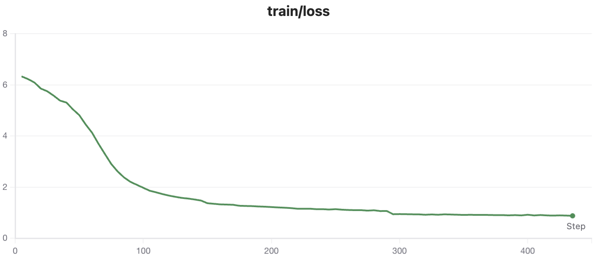

# build_clip_from_scratch
使用预训练模型快速组合构建一个类 CLIP 模型


## 快速启动

### 创建环境

```sh
conda create -n build_clip_from_scratch python=3.10 -y
conda activate build_clip_from_scratch
pip install -i https://pypi.tuna.tsinghua.edu.cn/simple -r requirements.txt
```


### 下载数据

```sh
cd data
download_ds.sh
```


### 制作模型

```
python make_model.py
```


### 模型训练

```
sh train.sh
```


### 模型推理

```
infer.py
```


## 最终效果

### 训练 loss 曲线



在 coco2017 数据集上进行训练，loss 使用 clip 方式，进行 3 轮训练。可见随着训练增减 loss 有明显下降。

### 推理效果

```
python infer.py
```

结果：

> 与文本：【a photo of a cat】最相似的图片是：【data/eval/000000039769.jpg】
> 与文本：【a photo of a dog】最相似的图片是：【data/eval/5850229113_4fe05d5265_z.jpg】

data/eval/000000039769.jpg：


5850229113_4fe05d5265_z.jpg


## 致谢

使用了 Transformers 提供的大量代码：https://github.com/huggingface/transformers/tree/main/examples/pytorch/contrastive-image-text